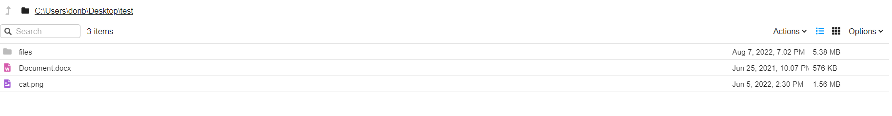
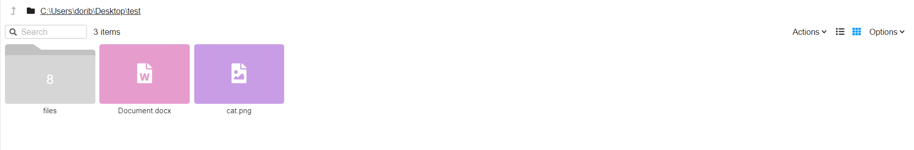

## FileBrowser Assignment for Qohash

## Project Preview

## How to run

To get the frontend running locally:
-   `cd frontend`  to install all req'd dependencies
-   `npm install`  to install all req'd dependencies
-   `npm start`  to start the local frontend

To get the backend running locally:
-   `cd backend`  to install all req'd dependencies
-   `npm install`  to install all req'd dependencies
-   `npm start`  to start the local backend

Replace the variable filePath inside backend/file.js with the path you want to explore.

Once completed, go to http://localhost:3000/

## Production Readiness

Some further actionable items to make it more production ready
- adding unit tests, end to end tests
- further separation of logic such as moving the traverse function into its own file
- improving on error handling, ie. toast notification in frontend if something goes wrong
- ability for user to specify folder path on frontend to traverse (however this is problematic to do due to Chrome security constraints regarding file paths)
- Fixing npm vulnerabilities on the frontend
- Improving file traversal speed
